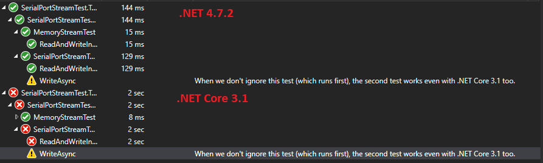

# SerialPortStreamTest

Tests the behaviour described in [this GitHub issue](https://github.com/jcurl/SerialPortStream/issues/114) for [SerialPortStream](https://github.com/jcurl/SerialPortStream).

With .NET Core 3.1 the `WriteAsync` call blocks while waiting for reading from the COM port with `ReadAsync` on another thread.

The unit test project sets up the two target frameworks .NET 4.7.2 and .NET Core 3.1. All tests will be run for both frameworks.
The unit test [`ReadAndWriteInDifferntThreadsAtSameTime`](./SerialPortStreamTest.Tests/SerialPortStreamTest.cs#L28) fails with .NET Core 3.1 but not with .NET 4.7.2

The behavior changes when we activate another test [`WriteAsync`](./SerialPortStreamTest.Tests/SerialPortStreamTest.cs#L12) by removing the `[Ignore]` attribute. When this test is executed _before_, the `ReadAndWriteInDifferntThreadsAtSameTime` tests also works with .NET Core 3.1.